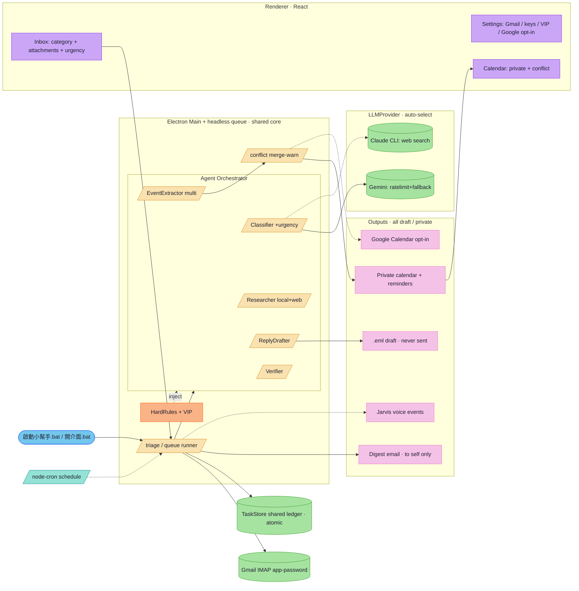

# Auto Email Assistant (desktop)

Dual-LLM (Claude Code CLI subscription / Gemini free) local-first desktop assistant
for daily family use. Reads real Gmail, triages with an 11-category taxonomy, extracts
appointments (multi-event) into a **private in-app calendar** with advance reminders +
schedule-conflict detection, drafts replies (**never sends**), finds supporting material
(local + web), sends a self-only daily digest, and bridges voice events to Jarvis.

> Author: JasonLee · License: Apache-2.0 · See `FAMILY-SETUP.md` to set up a family member.

## Status
- **Mail:** real Gmail via IMAP app-password (entered in Settings — no file editing).
- **LLM:** auto-selects Claude Code CLI if installed, else Gemini free. Keys in Settings.
- **Calendar:** private in-app calendar by default (a member is a public figure → not the
  public Google Calendar). Google Calendar sync is **opt-in** (Apps Script webhook).
- **Conflicts:** same meeting at one slot → merged; different meetings overlap → warned.
- **Drafts / send / pay / delete / settings:** drafts only; the app never sends, pays,
  deletes, or changes settings (see `SAFETY-CHECKLIST.md`).
- **Reliability:** durable task queue (ingest is LLM-free → no task loss; failures retry).

## Family install (recommended)
Full steps in `FAMILY-SETUP.md`. Order matters (one-time per person):
1. Copy the folder to their PC, run `npm install`.
2. **Double-click `開介面.bat`** to open the app window.
3. In **Settings**: enter the Gemini key + Gmail address & app-password (in-app, no file
   editing), press 執行分流 once to confirm.
4. **Then** double-click `啟動小幫手.bat` (or set boot auto-start) for the background daemon.

Daily: events appear in the private calendar, a digest email arrives; double-click
`開介面.bat` to review details.

## Run (dev)
```bash
npm install && npm run dev          # Settings → enter Gmail + key → 執行分流
npx tsx queue.ts run --watch        # headless daemon (queue + retry, what 啟動小幫手.bat runs)
npx tsc --noEmit                    # gate 1: typecheck
npx tsx safetytest.ts               # safety + conflict invariants
```

## Packaging note
`npm run build:win` produces a runnable app under `dist/win-unpacked/` (launch it or via
`開介面.bat`). The NSIS one-click installer currently needs Windows Developer Mode (the
electron-builder `winCodeSign` step extracts macOS symlinks). Ship the **unpacked** build
to family PCs; don't rely on on-device `npm run build`.

## Architecture
Three bundles (`electron-vite`): **main** (Node services), **preload** (contextBridge),
**renderer** (React). Swap-clean abstractions: `LLMProvider`, `MailProvider`,
`CalendarProvider`. The GUI and the headless daemon share one durable task ledger;
an in-app agent orchestrator judges complexity and fans out.



Interactive version (tabs / pan / zoom / mind-map): `docs/diagrams/2026-06-21_auto-email-assistant-app/architecture.html`.

## Hard rules (enforced)
Never send mail · never touch security/password settings · never move money ·
never delete · never draft replies to no-reply/marketing · material search is
read-only. All auto artifacts are tagged `[自動·待確認]`.
